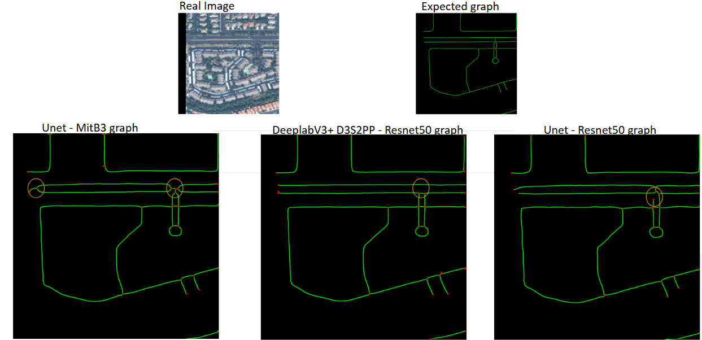

# Road Network Detection and Route Travel Time Estimation from Satellite Imagery

This repository contains the implementation of my Master's Thesis for the **Erasmus Mundus Master in Geospatial Technologies** https://run.unl.pt/entities/publication/061e3d4d-a3ae-45b7-97cc-bd90176abb5a. The project addresses the "Topology Gap" in automated road extraction by contrasting hierarchical Transformers against optimized CNN architectures.

## Key Highlights

* **Architectural Comparison:** Contrast between **SegFormer (MiT-B3)** with Self-Attention and **DeepLabV3+** with a custom **D3S2PP** module.
* **Topological Repair:** Integrated geometric post-processing heuristics (Filin et al. & Li et al.) to ensure network connectivity.
* **Advanced Evaluation:** Evaluation framework utilizing **APLS (Average Path Length Similarity)** and **Weisfeiler-Lehman (WL) Subtree Kernels** to measure structural isomorphism.

Here is a visual comparison of our topological extraction pipeline:

<p align="center">
  
</p>
## Methodology

The pipeline consists of four main stages:

1. **Data Preparation:** Radiometric normalization of 11-bit SpaceNet imagery and buffer rasterization.
2. **Feature Extraction:** Hierarchical encoding using Self-Attention (global context) vs. Atrous Convolutions (local context).
3. **Graph Extraction:** Skeletonization and vectorization of probability masks.
4. **Network Evaluation:** Functional routing analysis beyond standard pixel-wise metrics (IoU).

## Repository Structure

## Repository Structure

```text
DeepRoad-Extraction/
├── data/                       # Add to .gitignore
│   ├── raw/                    # Raw SpaceNet 11-bit imagery & GeoJSON labels
│   └── splits/                 # Dynamically generated train/val/test .txt lists
│
├── weights/                    # (Download links below)
│   ├── d3s2pp_resnet50.pth 
│   ├── unet_mit_b3.pth
│   ├── unet_resnet50.pth
│   ├── topo_d3s2pp_resnet50.pth
│   ├── topo_unet_mit_b3.pth
│   └── topo_unet_resnet50.pth
│
├── samples/                    # Sample imagery for quick-start testing
│
├── src/                        # Core Module Library
│   ├── data_prep/              # Preprocessing and dataset splitting logic
│   ├── models/                 # Architectures (SegFormer) and Custom Modules (D3S2PP)
│   ├── losses/                 # Custom Topology-Aware loss functions
│   ├── post_process/           # Vectorization & topological repair (Filin, Li)
│   └── utils/                  # Evaluation metrics (APLS, WL-Kernel, IoU)
│
├── train.py                    # Master entry point for model training
├── predict.py                  # Master entry point for inference & post-processing
├── evaluate.py                 # Master entry point for cross-city topological evaluation
├── requirements.txt            # Python dependencies
└── README.md                   # Project documentation
```

## Quick Start

Get up and running in under two minutes using the provided sample data.

**1. Clone and Configure**
```bash
git clone https://github.com/Mehdi1017/Road_Network_Extraction_using_satellite_imagery.git
cd Road_Network_Extraction_using_satellite_imagery

# Create and activate a virtual environment (recommended)
python -m venv venv
source venv/bin/activate  # On Windows use: venv\Scripts\activate

# Install dependencies
pip install -r requirements.txt
```

**2. Download Pre-trained Weights**
Download the pre-trained `.pth` files from the [Releases page](https://github.com/Mehdi1017/Road_Network_Extraction_using_satellite_imagery/releases/tag/segmentation_models) and place them directly into the `weights/` directory.

**3. Run Inference on Sample Data**
To verify your setup, run the prediction script on the included sample data using the SegFormer model and morphological post-processing:

```bash
# Assuming you created a small test list for the samples folder
python predict.py \
    --test_list samples/sample_list.txt \
    --model mit_b3 \
    --weights weights/unet_mit_b3_best.pth \
    --post_process morpho
```

*(Note: The prediction will be saved in `results/mit_b3/morpho_masks/samples/`)*

## Usage Guide

This repository uses modular entry-point scripts. You can see all available arguments for any script by passing the `--help` flag (e.g., `python train.py --help`).

### 1. Data Preprocessing
Convert the raw SpaceNet GeoJSON labels into 2-meter buffered raster masks. This script automatically processes all city directories found in `data/raw/`.

```bash
python src/data_prep/preprocess.py
```

### 2. Data Splitting
Generate the training, validation, and testing lists. The script writes relative paths to `data/splits/`.

```bash
# Generate both Combined and Per-City splits (Default)
python src/data_prep/split_data.py 

# Generate ONLY the combined cross-city splits
python src/data_prep/split_data.py --mode combined --ratio 0.8
```

### 3. Model Training
Train the network architectures. The script automatically handles loss function switching, learning rate scheduling, and early stopping.

```bash
# Baseline: Train ResNet50 with standard Pixel Loss (BCE/Dice)
python train.py --model resnet50 --loss pixel --batch_size 4 --epochs 100

# Thesis Contribution: Train custom D3S2PP with Topology-Aware Loss
python train.py --model d3s2pp --loss topo --epochs 100 --warmup 5

# Transformer: Train SegFormer MiT-B3 
python train.py --model mit_b3 --loss topo --batch_size 4

# Resume a crashed or stopped training run
python train.py --model mit_b3 --loss topo --resume
```
### 4. Inference & Post-Processing
The `predict.py` script handles model inference and applies specific topological repair heuristics (Filin et al., Li et al.) to the predicted masks. It can process a single image or an entire directory.

**Basic Usage:**
```bash
python predict.py --test_list data/splits/test_list_AOI_5_Khartoum_full.txt \
                  --model d3s2pp \
                  --weights weights/d3s2pp_resnet50_best.pth \
                  --post_process li \
                  --threshold 0.5
```

### 5. Advanced Evaluation & Metrics
The `evaluate.py` script automatically compares ground truth masks against your predictions across all available test cities. It calculates standard spatial metrics (IoU) alongside advanced topological algorithms, including Average Path Length Similarity (APLS) weighted by routing time, and Weisfeiler-Lehman (WL) Subtree Kernels.

**Basic Usage:**
```bash
# Evaluate a specific model and post-processing combination across all cities
python evaluate.py --model d3s2pp --post_process li

# Evaluate the baseline CNN
python evaluate.py --model resnet50 --post_process none

```
## Results example (Vegas no postprocess)

| Model | IoU | APLS | WL-Kernel | APLS_Time |
| :--- | :---: | :---: | :---: | :---: |
| ResNet50 + D3S2PP | 0.45 | 0.64 | 0.82 | 0.46 |
| **MiT-B3 + Unet** | **0.35** | **0.78** | **0.85** | **0.40** |

## Citation

```bibtex
@mastersthesis{gassa2026road,
  author  = {Gassa Malki, El Mehdi},
  title   = {Road Network Detection and Route Travel Time Estimation from Satellite Imagery},
  school  = {Erasmus Mundus Master in Geospatial Technologies},
  year    = {2026}
}
```

## License

Distributed under the MIT License.

## Contact & Acknowledgements

**El Mehdi Gassa Malki** - [LinkedIn](https://www.linkedin.com/in/el-mehdi-gassa-malki) - mehdigassamalki@gmail.com

Special thanks to my thesis supervisors Filipe Feitosa, Marco Painho, and Marcia Baptista, as well as the Erasmus Mundus GeoTech program for their support.